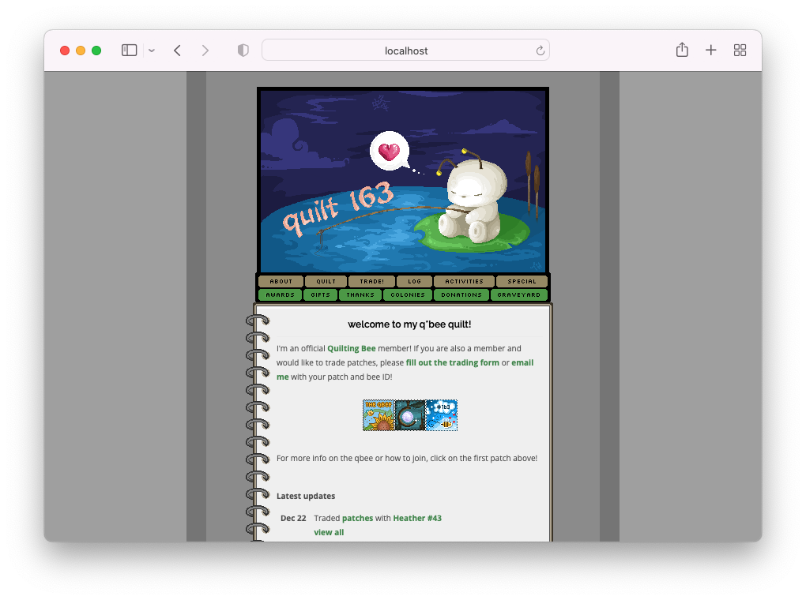

# qbee 🐝

Stumbled upon this in my old archives. 🥹

This was one of my earlier websites when my whole dev world revolved around the LAMP stack (from scratch) and Paint Shop Pro. I was part of a online, private pixel trading club -- on and off from '04 to '13 -- for personal web designers and developers called The Quilting Bee ([supersonicsquirrel.net/qbee][qbee-1], later [theqbee.net][qbee-2]). Approved members would have a little section on their website to display a "quilt" consisting of 40x40 patches they designed or received from other members in an exchange, and would be able to participate in club activities and forums.

- Everything outside of the `qbee/` directory is new and facilitates container setup.
- Broken links have been substituted with tooltips.
- Minor adjustments were made just enough to get the site up and running.

These were as much as I could salvage. A lot of content has since been lost. :(

## Local Setup

Run `make` to build and open up a local version of this site.

[qbee-1]: https://web.archive.org/web/20050421074957/http://www.supersonicsquirrel.net:80/qbee/
[qbee-2]: https://web.archive.org/web/20070225160054/http://theqbee.net/
